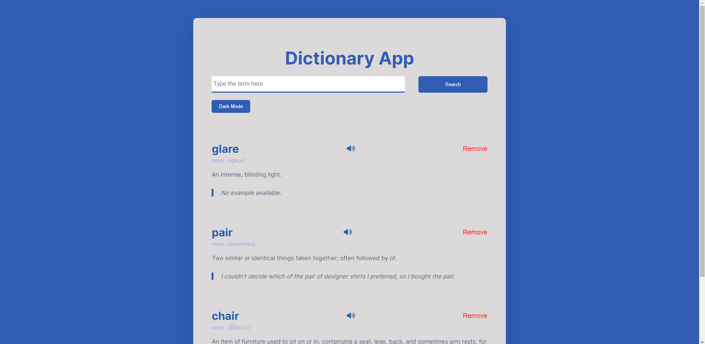

# Dictionary App

Dictionaries are a great way to learn new words and expand your vocabulary. This simple web application written using vanilla HTML, CSS, and JavaScript allows you to do just that. All you have to do is search for your desired word, and it will display the definition, part of speech, pronunciation, and example sentence (if applicable). The user can also press the speaker button to hear the word pronounced. The <a href="https://dictionaryapi.dev/" target="_blank">Free Dictionary API</a> is used to fetch the definitions. Each new word is added to the top of the page and can be removed by clicking the "Remove" button. The words are saved locally in the browser and will persist even after the page is closed.

## Features

- **Free Dictionary API**: This app uses the Free Dictionary API to fetch the definitions of words.
- **Local Storage**: The words are saved locally in the browser and will persist even after the page is closed.
- **Speaker Button**: The user can press the speaker button to hear the word pronounced.
- **Dark Mode**: The app has a dark mode feature that can be toggled on and off.
- **Responsive Design**: The app is responsive and will work on a variety of devices.

## Core Files

- `index.html`: The HTML file that contains the components used in app.
- `style.css`: The CSS file that contains the styles used in app. No media queries included!
- `script.js`: The JavaScript file that contains the logic used in app.
- `icon.png`: The icon used in the app's browser tab.

## How to Run

1. Download the files in this repository.
2. Open the `index.html` file in a web browser.
3. Search for a word and click the "Search" button or press the "Enter" key.

## Credits

This project was inspired by the video tutorial titled <a href="https://youtu.be/PUkgK7TI0x0?si=M_VAM2DfkmDYITxT" target="_blank">Dictionary App | HTML, CSS And Javascript | JS Project
</a> by Coding Artist. More styling options, local storage functionality, and the ability to add more than one word to the screen were added to the project independently.